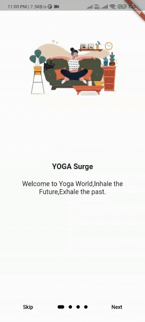

 **Flutter** is new for me, since i was familiar  with javascript, i was able to catch up **Dart** quickly and work on it fast but still the framework was twisted  and i kind of had a hard time researching what to do next .but eventually i got it 😌 .
 

 

</a>

